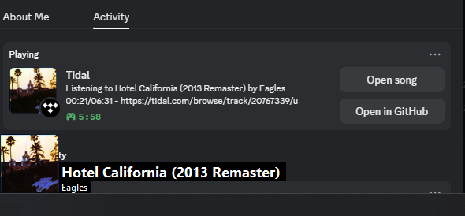
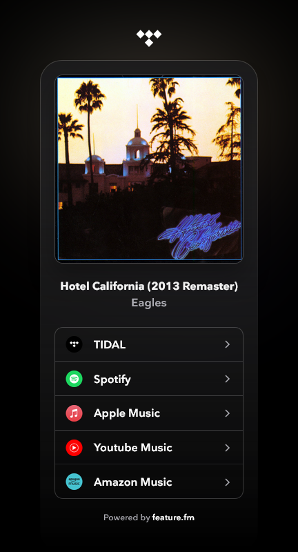

# TidalDiscord

Shows what you're listening to on the Tidal desktop app in Discord. Also provides an overlay in the bottom left corner of your screen.



Note: uses NPSM so if you have multiple things playing at once it may break

Clicking "Open song" opens a feature.fm menu to listen to the song on multiple different platforms, and "Open in GitHub" brings you here



## Installation

```bash
git clone https://github.com/tpguy825/TidalDiscord.git
cd TidalDiscord
copy env.example.json env.json
notepad env.json # Complete with your Tidal API credentials
dotnet run # Requires .NET 8
```

### Getting a Tidal API key

1. Go to the [Tidal Developer Dashboard](https://developer.tidal.com/dashboard)
2. Create New App => enter app name => create app
3. Put client ID and secret in `env.json`

### Setting up the Discord app

1. Go to the [Discord Developer Portal](https://discord.com/developers/applications)
2. Create a new application and name it "Tidal" so it shows up as "Playing Tidal"
3. Copy application ID and paste it into `env.json`
4. Sidebar => Rich presence => art assets
5. upload `assets/untitles.jpg` and name it "untitled"
    * this shows up in the bottom left of the album cover - can be anything just name it "untitled"
